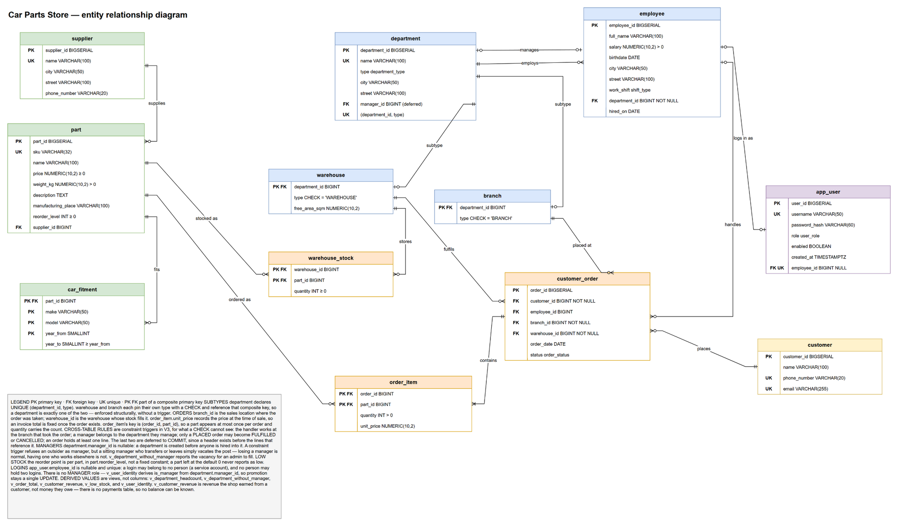
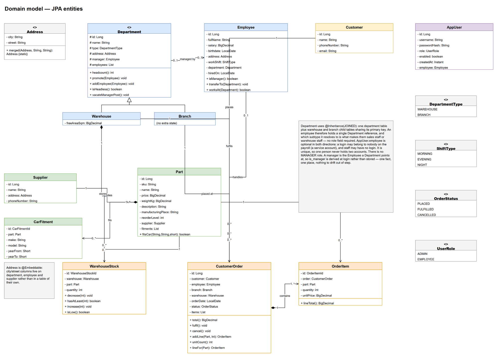
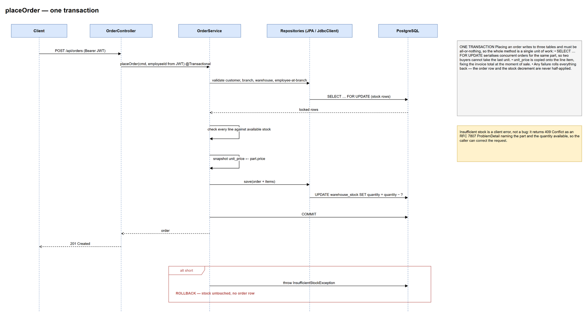

# Car Parts Store

A REST API for a car parts retail business — customers, branches, warehouses, staff,
suppliers, a parts catalogue, stock, and orders.

Java 21 · Spring Boot 3.3 · PostgreSQL 16 · Flyway · Spring Data JPA + `JdbcClient` ·
Spring Security with JWT · springdoc-openapi · Maven

---

## Status

Complete.

| | |
|---|---|
| Schema — 12 tables, 6 views, 6 triggers, Flyway V1–V6 | done |
| Deterministic demo dataset | done |
| JPA domain model — 20 classes, 10 repositories | done |
| `OrderService.placeOrder` — transactional, concurrency-safe | done |
| REST API — 48 endpoints, DTOs, RFC 7807 errors, OpenAPI | done |
| JWT security — login, roles, per-department manager rule | done |
| Invoice PDF | done |
| Test suite — 210 tests, 96% instructions / 90% branches | done |
| CI — GitHub Actions on every push and pull request | done |
| Documentation | done |

Every test runs against a real PostgreSQL 16 with the real migrations applied, not a mock and
not H2. A full CI run takes about a minute.

---

## Documentation

| | |
|---|---|
| [docs/architecture.md](docs/architecture.md) | the system — layers, security, errors, known gaps |
| [docs/api.md](docs/api.md) | every endpoint, its parameters, and who may call it |
| [docs/database.md](docs/database.md) | the schema — design decisions, constraints, views, triggers |
| [docs/testing.md](docs/testing.md) | what is tested, how, and what was found |
| [PLAN.md](PLAN.md) | the roadmap this was built against |
| [docs/diagrams/](docs/diagrams/) | ERD, class diagram, order sequence — shown below |

---

## Running it

You need **JDK 21** and **PostgreSQL 16**. Maven comes with the wrapper.

**1. Create the database and a role**

```sql
CREATE DATABASE carparts;
CREATE USER carparts_app WITH PASSWORD 'choose-something';
GRANT ALL PRIVILEGES ON DATABASE carparts TO carparts_app;
```

**2. Supply local configuration**

Copy the template and fill it in. The real file is git-ignored:

```bash
cp src/main/resources/application-local.example.yml src/main/resources/application-local.yml
```

The demo accounts need BCrypt digests at cost 12 — generate one per password:

```bash
python -c "import bcrypt;print(bcrypt.hashpw(b'YOUR-PASSWORD', bcrypt.gensalt(12, prefix=b'2a')).decode())"
```

You also need a signing secret for the JWTs, at least 32 bytes:

```bash
openssl rand -base64 48
```

It has no default on purpose. An unset, too-short or unresolved `JWT_SECRET` stops the
application at start-up with a message naming the property — a fallback secret is a published
secret.

Deployments set the environment variables named in [`.env.example`](.env.example) instead.
Spring Boot does not read `.env` files itself; the `local` profile is the mechanism for
development.

**3. Start it**

```bash
./mvnw spring-boot:run -Dspring-boot.run.profiles=local
```

Flyway applies `V1`–`V6` on start-up, creating the schema and the demo dataset. Hibernate then
validates every entity mapping against it, so a mismatch fails the start rather than surfacing
later.

Then open <http://localhost:8080/swagger-ui>, log in through `POST /api/auth/login` with one of
the demo accounts, and paste the token into **Authorize**.

**4. Run the tests**

```bash
./mvnw verify
```

No database setup needed — the suite starts its own PostgreSQL.

---

## What is interesting here

The schema does most of the work. Four decisions worth the click through to
[docs/database.md](docs/database.md):

**Branches and warehouses are disjoint subtypes, enforced without a trigger.** `department`
declares `UNIQUE (department_id, type)`; each subtype pins its own type with a `CHECK` and
references that composite key. A department is exactly one of the two, guaranteed by a plain
foreign key.

**An invoice total cannot drift.** `order_item.unit_price` captures the price at the moment of
sale and is never read back from the catalogue, so repricing a part leaves settled orders
untouched.

**Overselling is impossible, including under concurrency.** Placing an order locks the stock
rows with `SELECT ... FOR UPDATE` until commit. Two simultaneous orders for the last unit end
with exactly one order and stock at zero — verified by a concurrency test, not assumed.

**Derived values are views, never columns.** Headcounts, order totals, customer revenue and
low stock are computed on read. There is no stored copy to fall out of step.

And one from the test suite: `QueryCountTest` asserts how many queries a page costs. With
`Part.supplier` switched to `EAGER` and its fetch join removed, every other test still passes
while the parts listing quietly goes from 2 queries to 14. Only that test fails.

---

## Diagrams

**Entity relationship diagram.** The 12 tables, the disjoint subtypes, and a legend explaining
each decision.



**Domain model.** The JPA entities, their associations, and the behaviour that lives on them.



**Placing an order.** One transaction, from the request through the row locks and back.



The `.drawio` files beside these images are the editable sources. After changing one, re-export
it with the draw.io desktop app:

```bash
draw.io --export --format png --border 16 --width 2000 --theme light   --output docs/diagrams/erd.png docs/diagrams/erd.drawio
```

---

## Layout

```
src/main/java/com/carparts/
  domain/          entities, embeddables, enums
  repository/      Spring Data interfaces + JdbcClient reporting
  service/         business rules and the exceptions they raise
  web/             controllers, RFC 7807 handler, request/response DTOs
  security/        JWT issue and parse, the filter chain, the manager rule
  support/         small shared helpers
  config/          OpenAPI description

src/main/resources/db/migration/
  V1__core_tables.sql              enums, department + subtypes, staff, catalogue
  V2__orders_and_stock.sql         orders, lines, stock, fitments
  V3__constraints_and_indexes.sql  deferred FK, cross-table triggers, FK indexes
  V4__views.sql                    the derived values
  V5__auth.sql                     login accounts
  V6__seed_demo_data.sql           demo dataset

src/test/java/com/carparts/        210 tests against a real PostgreSQL
```

---

## Notes

Demo credentials are **not** in this repository. `V6` takes its password hashes from Flyway
placeholders resolved from the environment, and neither has a default — an unset variable
fails the migration rather than seeding an account whose password could be read here.

`V6` also seeds ADMIN accounts and fake business data into whatever database it is pointed at.
A deployment that does not want demo data must exclude it deliberately.

---

## Licence

[MIT](LICENSE)
